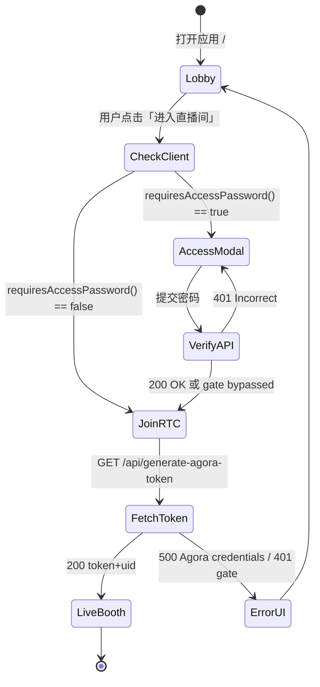
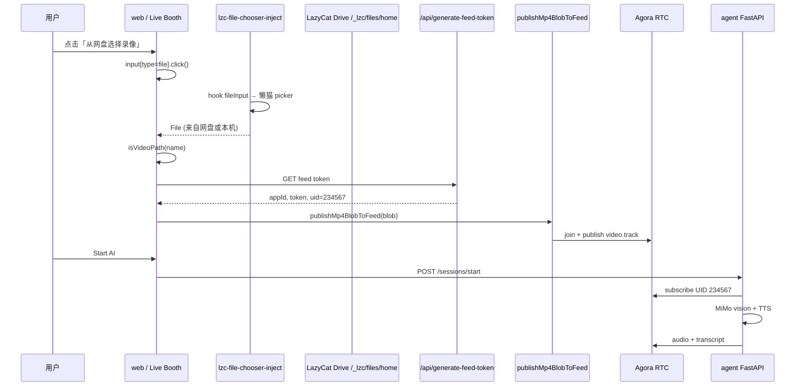

# 架构：懒猫微服专题修复（v0.2）

| 字段 | 值 |
|------|-----|
| 版本 | v0.2 |
| 日期 | 2026-06-30 |
| 关联 | [PRD-v0.2](./PRD-v0.2.md) · [IMPLEMENTATION_PLAN.md](./IMPLEMENTATION_PLAN.md) |

---

## 1. 总体拓扑（不变）

与 v0.1 相同：LPK 内 `web` + `agent`；网盘 MP4 经浏览器 publish 至 Agora UID 234567；agent MiMo 订阅解说。见 [ARCHITECTURE.md §1](./ARCHITECTURE.md)。

---

## 2. P0 根因：Build-Time vs Runtime 环境变量

### 2.1 问题本质

Next.js 将 `NEXT_PUBLIC_*` **编译进客户端 bundle**。Docker 多阶段构建在 `pnpm run build` 时读取 `ARG`/`ENV`，之后 manifest 注入的 runtime env **无法 retroactively 修改**已生成 JS。

```text
                    ┌──────────────────┐
  deploy-params ──► │ lzc-cli build    │
                    │  render build_args│
                    └────────┬─────────┘
                             │
              Dockerfile ARG NEXT_PUBLIC_*
                             │
                             ▼
                    ┌──────────────────┐
                    │ pnpm run build   │  ← bundle 固化
                    └────────┬─────────┘
                             │
  manifest env ──►  runtime container     ← 仅影响 SSR/API/服务端
                             │
                             ▼
              客户端 requiresAccessPassword() 读 bundle 内常量
              服务端 isAccessGateEnabled() 读 process.env（runtime）
```

### 2.2 失败模式：客户端/服务端不同步

| 场景 | 客户端（bundle） | 服务端（runtime） | 用户现象 |
|------|------------------|-------------------|----------|
| **A. 典型 P0** | 未设 LAZYCAT → 要密码 | manifest 设 LAZYCAT → 门禁关 | 见弹窗；verify 可能 200 但体验混乱；或 token 401 |
| **B. Agora 缺失** | APP_ID 空 | 证书 runtime 有 | token API 500 credentials not set |
| **C. 全关** | build 正确免密 | runtime 正确 | ✅ 正常 |
| **D. inject 误判** | 仍要密码 | — | inject 只填 HTML 表单，**不控制** React modal |

### 2.3 修复架构：双保险

| 层 | 机制 | 配置位置 |
|----|------|----------|
| **Build** | `NEXT_PUBLIC_LAZYCAT_DEPLOYED=true`、`NEXT_PUBLIC_REQUIRE_ACCESS_PASSWORD=false`、`NEXT_PUBLIC_AGORA_APP_ID` | `lzc-build.yml` → `images.web.build_args` |
| **Runtime（web）** | 同名 `NEXT_PUBLIC_*` + `LAZYCAT_DEPLOYED=true` | `lzc-manifest.yml` → `services.web.environment` |
| **Runtime（API）** | `isAccessGateEnabled()` 读 `LAZYCAT_DEPLOYED` | `lib/accessPassword.ts` |
| **Client UI** | `requiresAccessPassword()` | `lib/lazycat/netdisk-path.ts` |
| **提审辅助** | inject `passwordless-entry` | manifest `application.injects` |
| **可选兜底（P1）** | hostname 检测 `.heiyu.space` | `lib/lazycat/runtime.ts`（规划） |

---

## 3. 免密登录：方案与状态机

### 3.1 方案组合

| 方案 | 说明 | v0.2 决策 |
|------|------|-----------|
| A | build + runtime 跳过门禁 | **主路径** |
| B | `builtin://simple-inject-password` | **保留**；提审文案，非唯一手段 |
| C | `X-HC-User-ID` Header | V1.5 可选 |

### 3.2 进门状态机



### 3.3 目标态 manifest / build 片段

**`lzc-build.yml`（web build_args，M1 必达）：**

```yaml
images:
  web:
    dockerfile: Dockerfile
    build_args:
      NEXT_PUBLIC_AGORA_APP_ID: "{{ params.agora_app_id }}"
      NEXT_AGORA_APP_CERTIFICATE: "{{ params.agora_app_certificate }}"
      NEXT_PUBLIC_LAZYCAT_DEPLOYED: "true"
      NEXT_PUBLIC_REQUIRE_ACCESS_PASSWORD: "false"
  agent:
    dockerfile: server/Dockerfile
```

**`lzc-manifest.yml`（web runtime，与 build_args 对齐）：**

```yaml
services:
  web:
    image: registry.lazycat.cloud/<org>/worldcupvoice-web:<tag>  # M4 提审
    environment:
      AGENT_BACKEND_URL: http://agent:8000
      NEXT_PUBLIC_AGORA_APP_ID: "{{ params.agora_app_id }}"
      NEXT_AGORA_APP_CERTIFICATE: "{{ params.agora_app_certificate }}"
      NEXT_PUBLIC_LAZYCAT_DEPLOYED: "true"
      NEXT_PUBLIC_REQUIRE_ACCESS_PASSWORD: "false"
      LAZYCAT_DEPLOYED: "true"
      BACKEND_API_SECRET: "{{ params.backend_api_secret }}"
      NEXT_PUBLIC_LIVE_CHANNEL_NAME: worldcup-live
      NEXT_PUBLIC_AGENT_UID: "123456"
      NEXT_PUBLIC_MATCH_FEED_UID: "234567"

application:
  injects:
    - id: passwordless-entry
      on: browser
      when: ["/*"]
      do:
        - src: builtin://simple-inject-password
          params:
            username: ""
            password: ""
```

**本地 Docker（TC-AUTH-02）：** `docker-compose.yml` 默认 `NEXT_PUBLIC_LAZYCAT_DEPLOYED=false`；设 `ACCESS_PASSWORD=dev123`。

完整参考见 [fixtures/](./fixtures/)（M1 起同步 build_args）。

---

## 4. MP4 网盘导入：端到端序列图

### 4.1 Import 序列（P0 审计范围）



### 4.2 节点规格表

| 节点 | 输入 | 输出 | 权限 | 失败模式 | 用例 |
|------|------|------|------|----------|------|
| UI 按钮 | 用户点击 | `input.click()` | — | disabled 态 | TC-NET-03 |
| inject hook | click 事件 | File / path | document.read | picker 不弹出 → 检查 inject 加载 | TC-NET-03 |
| `isVideoPath` | 文件名 | boolean | — | 非 mp4/webm/mov → 中文错误 | TC-NET-07 |
| `generate-feed-token` | channel | token, appId | 门禁 bypass 或 cookie | 401 gate / 500 Agora | AC-P0-03 |
| fetch 网盘（若走 URL） | normalized path | Blob | document.read, media.read | 403 权限 / 404 | TC-NET-04 |
| `publishMp4BlobToFeed` | Blob | RTC publisher | net.internet | 解码失败 / join 失败 | TC-NET-05 |
| Start AI | session API | 字幕流 | net.internet | MiMo key 缺失 | TC-DEP-02, TC-NET-06 |

**Path 规范：**

- inject `diskRoot`: `/_lzc/files/home`
- `normalizeLazyCatPath('/_lzc/files/home/Movies/a.mp4')` → `/Movies/a.mp4`
- `buildLazyCatFileUrl('/Movies/a.mp4')` → `/_lzc/files/home/Movies/a.mp4`

**当前实现说明：** `NetdiskVideoPicker` 通过 inject 拦截 `<input type=file>` 直接获得 `File` 对象，**不一定**再 fetch URL；若未来改 URL 拉取，须保持 normalize 一致。

### 4.3 Export 链路（本期：未实现）

| 节点 | 状态 |
|------|------|
| UI「保存到网盘」 | ❌ 无 |
| inject save hook | ❌ manifest 未启用 |
| `document.write` | optional，未使用 |

V1.5 若做最小 export（解说稿 `.txt`/`.srt`）：需新增 US、UI、`document.write` required、inject save 参数。见 PRD-v0.2 §2.4。

### 4.4 M1 vs M2 桥接（COEP）

| 模式 | when | 条件 |
|------|------|------|
| M1 | `/*` | 当前默认；Agora 无 COEP 硬性要求 |
| M2 | `/lazycat-picker.html*` | COEP 导致 picker 失败时切换 |

见 `.cursor/skills/lazycat-lpk-netdisk/SKILL.md`。

### 4.5 与 publish-local-feed.mjs 差异

| 维度 | 本机 dev | 懒猫微服 |
|------|----------|----------|
| 视频源 | 宿主机 MP4 文件 | 网盘 File / Blob |
| 发布方式 | Node Playwright 脚本 | 浏览器 `publishMp4BlobToFeed` |
| UID | 234567 | 234567（一致） |
| 命令 | `pnpm run feed:local` | UI「从网盘选择录像」 |

**禁止混用：** 微服真机验收不要依赖 `feed:local`。

---

## 5. 环境变量矩阵（Build vs Runtime）

| 变量 | Build (web) | Runtime (web) | Runtime (agent) | 客户端可见 | 说明 |
|------|:-----------:|:-------------:|:---------------:|:----------:|------|
| `NEXT_PUBLIC_LAZYCAT_DEPLOYED` | **必** true | **必** true | — | 是 | 跳过密码 UI |
| `NEXT_PUBLIC_REQUIRE_ACCESS_PASSWORD` | **必** false | **必** false | — | 是 | 显式关闭 |
| `LAZYCAT_DEPLOYED` | — | **必** true | — | 否 | API 门禁 |
| `ACCESS_PASSWORD` | — | **不设** | — | 否 | 仅本地 Docker |
| `NEXT_PUBLIC_AGORA_APP_ID` | **必** | **必** | — | 是 | RTC |
| `NEXT_AGORA_APP_CERTIFICATE` | **必** | **必** | — | 否* | token 签发（API route） |
| `AGORA_APP_ID` | — | — | **必** | 否 | agent |
| `AGORA_APP_CERTIFICATE` | — | — | **必** | 否 | agent |
| `MIMO_API_KEY` | — | — | **必** | 否 | agent |
| `BACKEND_API_SECRET` | — | **必** | **必** | 否 | session API |

\* `NEXT_AGORA_APP_CERTIFICATE` 仅在服务端 Route Handler 使用，不进客户端 bundle 逻辑路径，但仍需 runtime 容器 env。

---

## 6. LPK 构建拓扑（Fat vs Thin）

```text
开发调试（M1）                    提审（M4）
─────────────────                ─────────────────
lzc-build.yml                    lzc-build.yml（无 images）
  images: web, agent               manifest → registry 镜像
  embed:web / embed:agent
       │                                │
       ▼                                ▼
project build → fat lpk            project release → ~1MB lpk
lpk install 本地验证               appstore publish
```

Fat 包当前根目录配置：`lzc-manifest.yml` 使用 `embed:web` / `embed:agent`，`lzc-build.yml` 含 `images:` 段——**符合 M1 本地调试，不符合 M4 提审**。

---

## 7. 安全与合规（继承 + v0.2）

1. 密钥仅经 `lzc-deploy-params`（`type: secret`）注入；禁止 git / log 明文。
2. 网盘 **import**：仅用户主动选择的文件；不目录遍历。
3. **export 本期无**：用户解说字幕仅实时展示，不持久化到第三方（Agora/MiMo 传输除外）。
4. 权限最小化：`document.write` optional 且未启用。
5. 提审 AI 免责声明见 [STORE_REVIEW_NOTES.md](./STORE_REVIEW_NOTES.md)。

---

## 8. 关键源码索引

|  Concern | 文件 |
|----------|------|
| 服务端门禁 | `lib/accessPassword.ts` |
| 客户端门禁 | `lib/lazycat/netdisk-path.ts` → `requiresAccessPassword()` |
| 入口 UI | `components/LandingPage.tsx` |
|  verify API | `app/api/verify-access/route.ts` |
| Agora token | `app/api/generate-agora-token/route.ts` |
| Feed token | `app/api/generate-feed-token/route.ts` |
| 网盘 UI | `components/NetdiskVideoPicker.tsx` |
| MP4 publish | `lib/agora/publish-mp4-feed.ts` |
| inject | `content/lazycat-injects/lzc-file-chooser-inject.js` |
| Docker build ARG | `Dockerfile` L16-23 |
| LPK 配置 | `lzc-build.yml`, `lzc-manifest.yml`, `package.yml` |
