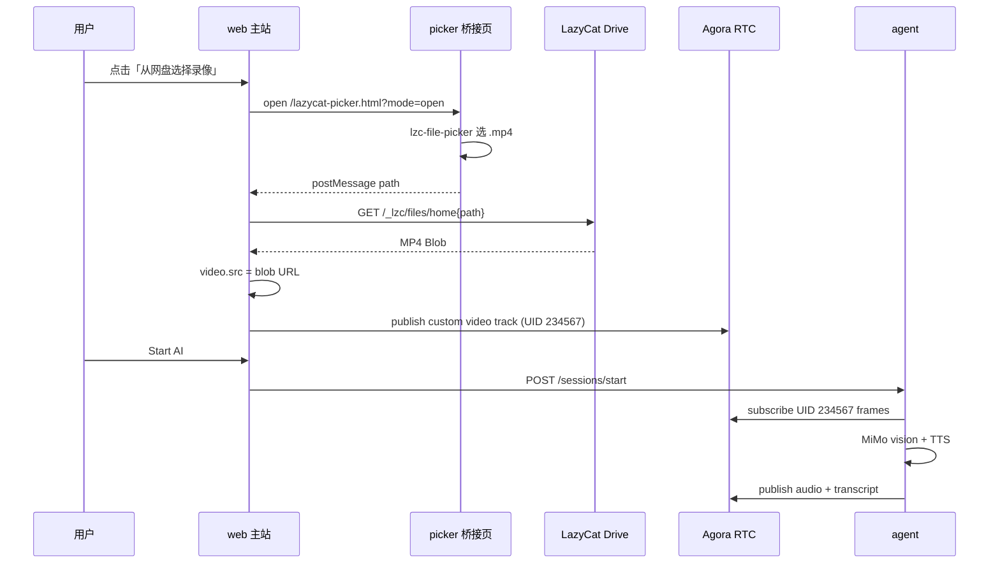

# 架构：懒猫微服二次开发（LPK + 免密 + 网盘 MP4 → AI 解说）

| 字段 | 值 |
|------|-----|
| 版本 | v0.1 |
| 日期 | 2026-06-29 |
| 关联 | [PRD.md](./PRD.md) · [TEST_CASES.md](./TEST_CASES.md) |

---

## 1. 总体拓扑

### 1.1 一阶段（当前已实现）

```text
┌─────────────┐     RTC      ┌──────────────────┐
│ feed:local  │─────────────►│ Agora Channel    │
│ (本机 mp4)  │  UID 234567  │ worldcup-live    │
└─────────────┘              └────────┬─────────┘
                                      │ subscribe frames
┌─────────────┐  HTTP API   ┌─────────▼─────────┐
│ Browser     │◄───────────►│ agent (FastAPI)   │
│ Next.js     │  Start AI   │ MiMo vision + TTS │
└─────────────┘             └───────────────────┘
```

### 1.2 二阶段目标（懒猫微服）

```text
┌──────────────────────────────────────────────────────────────┐
│ LazyCat Box — LPK WorldCupVoice                              │
│                                                              │
│  ┌─────────────┐   inject     ┌─────────────────────────┐  │
│  │ Lazycat     │─────────────►│ web (Next.js)           │  │
│  │ Ingress     │  免密/headers │ / 直播间 UI             │  │
│  └─────────────┘              │ /lazycat-picker.html(M2)│  │
│                               └───────┬─────────────────┘  │
│                                       │ AGENT_BACKEND_URL    │
│                               ┌───────▼─────────────────┐  │
│                               │ agent (FastAPI)         │  │
│                               │ 现有 BackendCommentator │  │
│                               └───────┬─────────────────┘  │
│                                       │ Agora RTC SDK      │
│  网盘 /_lzc/files/home/…mp4          │                    │
│       │                               │                    │
│       ▼ fetch Blob                    ▼                    │
│  ┌─────────────────────────────────────────┐               │
│  │ 浏览器：video + canvas captureStream     │──publish────►│
│  │ 或 Agora custom video track             │  UID 234567   │
│  └─────────────────────────────────────────┘               │
└──────────────────────────────────────────────────────────────┘
```

**关键变化：** 视频源从「宿主机 Playwright 脚本」变为「微服内浏览器读取网盘 MP4 并发布 RTC」。

---

## 2. LPK 目录与构建

### 2.1 目标仓库布局（M1 实装）

```text
worldcupvoice/
├── lzc-build.yml           # pkgout、icon、docker 镜像构建
├── lzc-manifest.yml        # services、routes、injects、env 模板
├── package.yml             # 元数据、权限、locales
├── lzc-deploy-params.yml   # MiMo / Agora / 可选 AI
├── icon.png
├── content/                # inject 脚本（从 lazycat-injects 复制）
│   └── lazycat-injects/
│       └── lzc-file-chooser-inject.js
├── docker-compose.yml      # 已有
├── Dockerfile              # web
└── server/Dockerfile       # agent
```

参考 YAML 见 [fixtures/](./fixtures/)（契约测试校验，非运行时自动加载）。

### 2.2 服务与路由

| 服务 | 镜像 | 端口 | 路由 |
|------|------|------|------|
| `web` | worldcupvoice-web | 3000 | `/` → 前端 |
| `agent` | worldcupvoice-agent | 8000 | 集群内 `http://agent:8000`；不对公网暴露敏感 API |

前端环境变量（manifest 渲染）：

```yaml
# 示意
web:
  environment:
    AGENT_BACKEND_URL: http://agent:8000
    NEXT_PUBLIC_AGORA_APP_ID: "{{ params.agora_app_id }}"
    # 微服模式：不设 NEXT_PUBLIC_REQUIRE_ACCESS_PASSWORD=true
```

Agent 环境变量：

```yaml
agent:
  environment:
    MIMO_API_KEY: "{{ params.mimo_api_key }}"
    AGORA_APP_ID: "{{ params.agora_app_id }}"
    AGORA_APP_CERTIFICATE: "{{ params.agora_app_certificate }}"
    BACKEND_API_SECRET: "{{ params.backend_api_secret }}"
    VISION_PROVIDER: "{{ params.vision_provider | default('mimo') }}"
    TTS_PROVIDER: "{{ params.tts_provider | default('mimo') }}"
```

### 2.3 权限（package.yml）

```yaml
permissions:
  required:
    - net.internet      # MiMo + Agora
    - document.read     # 网盘选文件
    - media.read        # 视频/mp4
  optional:
    - document.write    # 若未来支持导出解说稿
```

---

## 3. 免密登录设计

### 3.1 策略选择

| 方案 | 适用 | WorldCupVoice 选择 |
|------|------|-------------------|
| A. 去掉进门密码（仅微服） | 应用无独立账号 | **主路径**：`LAZYCAT_DEPLOYED=true` 跳过密码 UI |
| B. `simple-inject-password` | 必须保留密码框的上游 | 备选 / 本地调试 |
| C. OIDC | 复杂账号体系 | 非本期 |

### 3.2 前端门禁逻辑（待实装）

```typescript
// lib/lazycat/runtime.ts（规划）
export function requiresAccessPassword(): boolean {
  if (process.env.NEXT_PUBLIC_LAZYCAT_DEPLOYED === 'true') return false;
  return Boolean(process.env.NEXT_PUBLIC_REQUIRE_ACCESS_PASSWORD ?? 'true');
}
```

| 环境 | `NEXT_PUBLIC_LAZYCAT_DEPLOYED` | 行为 |
|------|-------------------------------|------|
| 本地 Docker | `false` / 未设 | 显示 `ACCESS_PASSWORD` 对话框 |
| 懒猫 LPK | `true`（manifest 注入） | 直接进入 Live Booth |

### 3.3 manifest inject（审核友好）

```yaml
# lzc-manifest.yml 片段 — 见 fixtures
application:
  injects:
    - id: passwordless-entry
      on: browser
      when:
        - /*
      do:
        - src: builtin://simple-inject-password
          params:
            username: ""
            password: ""
```

若应用无登录表单，inject 与「跳过密码 UI」组合即可满足弱感知进门；提审说明写清：**微服入口已鉴权，应用内不再二次索要密码**。

---

## 4. 网盘 MP4 → RTC → AI 解说

### 4.1 数据流



### 4.2 路径规范化

网盘 picker 返回 path 需统一（实现于 `lib/lazycat/netdisk-path.ts`）：

```typescript
normalizeLazyCatPath('/_lzc/files/home/Movies/a.mp4')
// → '/Movies/a.mp4'

buildLazyCatFileUrl('/Movies/a.mp4')
// → '/_lzc/files/home/Movies/a.mp4'
```

### 4.3 视频发布（浏览器侧）

复用一阶段 `match_feed_uid=234567` 约定：

1. 创建隐藏 `<video muted playsinline>` 加载 Blob URL
2. `video.play()` 后从 `HTMLVideoElement` 或 canvas 取 `MediaStream`
3. 使用 `agora-rtc-sdk-ng` `createCustomVideoTrack` / `client.publish`
4. UI 显示「正在播放网盘录像 · 解说生成中」

**不采用：** agent 容器内 ffmpeg 读取网盘挂载路径（权限与打包复杂度高）。

### 4.4 inject 模式：M1 vs M2

| 模式 | 条件 | manifest when |
|------|------|---------------|
| **M1** 主站 inject | Agora 不需 COEP | `/*` |
| **M2** 桥接页 | 未来若加 ffmpeg.wasm / COEP | `/lazycat-picker.html*` only |

当前 Agora Web SDK **无 COEP 硬性要求**，优先 **M1**；若真机 picker 卡死，切 **M2**（见 `lazycat-lpk-netdisk` skill）。

### 4.5 与 feed:local 的关系

| 源 | 场景 | 脚本 |
|----|------|------|
| `publish-local-feed.mjs` | 开发者本机 Docker | 保留 |
| 网盘 MP4 浏览器发布 | 懒猫微服用户 | 二阶段新增 |

---

## 5. AI Provider 配置（继承一阶段）

二阶段**不重写** AI 层，仅通过 deploy-params 暴露已有环境变量：

| 变量 | 默认 | 说明 |
|------|------|------|
| `VISION_PROVIDER` | `mimo` | `openai` 回退 |
| `TTS_PROVIDER` | `mimo` | `fish_audio` / `elevenlabs` / `openai` |
| `MIMO_API_KEY` | 部署填写 | P0 必填 |
| `OPENAI_API_KEY` | 可选 | 仅当 provider=openai |

`settings_for_commentator_profile` 行为不变：全局 `mimo` 锁定 TTS。

---

## 6. 安全与合规

1. **密钥**只经 `lzc-deploy-params`（`type: secret`）进入运行时 env，不进 Git。
2. **日志**禁止打印 `MIMO_API_KEY`、`AGORA_APP_CERTIFICATE`。
3. **网盘**仅读取用户主动选择的文件，不扫描全盘。
4. **提审**说明 AI 解说为实时生成，不存储用户录像到第三方（除 Agora/MiMo 传输）。

---

## 7. 实现顺序（推荐）

```text
M0 文档 + fixtures + 契约测试（本提交）
    ↓
M1 lzc 三件套 + 免密环境变量 + lpk install 冒烟
    ↓
M2 lib/netdisk + picker UI + Agora 发布 MP4
    ↓
M3 deploy-params 联调 + verify-ai-pipeline 在 box 上跑通
    ↓
M4 提审 checklist + publish
```

---

## 8. 文件清单（二阶段将新增/修改）

| 文件 | 操作 |
|------|------|
| `lzc-build.yml` | 新增 |
| `lzc-manifest.yml` | 新增 |
| `package.yml` | 新增 |
| `lzc-deploy-params.yml` | 新增 |
| `lib/lazycat/runtime.ts` | 新增 |
| `lib/lazycat/netdisk-path.ts` | 新增 ✅ |
| `components/NetdiskVideoPicker.tsx` | 新增 |
| `components/ConversationComponent.tsx` | 修改：集成选片 + 发布 |
| `public/lazycat-picker.html` | 新增（M2） |
| `content/lazycat-injects/*` | 复制官方 inject |
