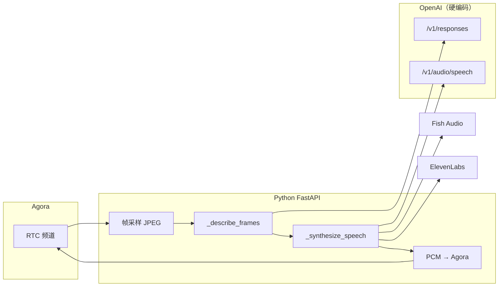
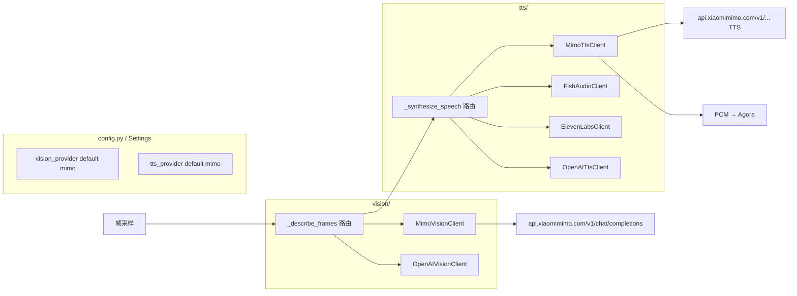

# 架构：小米 MiMo 作为默认 AI Provider

| 字段 | 值 |
|------|-----|
| 版本 | v0.2（审阅修订） |
| 日期 | 2026-06-29 |

---

## 0. 审阅结论（v0.1 → v0.2）

| 维度 | 评分 | 说明 |
|------|------|------|
| 方向 | ✅ 正确 | 默认 MiMo 替代 OpenAI，Agora 不动 |
| API 映射（视觉） | ✅ 可行 | `chat/completions` + `image_url` 与上游帧采样兼容 |
| API 映射（TTS） | ⚠️ 待实测 | 应对齐 [MiMo TTS OpenAI 兼容](https://mimo.mi.com/docs/zh-CN/api/voice/tts-openai) 的 `/audio/speech` |
| 配置优先级 | ❌ v0.1 未写清 | **已被代码证伪**，见 §2.1 |
| 启动门禁 | ❌ v0.1 未写清 | `session_manager` 仍硬检查 `OPENAI_API_KEY` |
| 模块拆分 | ⚠️ 分两期 | 图示为终态；M1 在 `backend_commentator.py` 内分支即可 |

---

## 1. 现状（上游）



**痛点**：`backend_commentator.py` 中 `OPENAI_RESPONSES_URL` / `OPENAI_SPEECH_URL` 写死；`VISION` 与 `TTS` 无 Provider 抽象。

---

## 2. 目标架构



**原则**：

1. **默认 MiMo**，显式 env 才切回 OpenAI / Fish / ElevenLabs
2. **最小侵入**：M1 在 `backend_commentator.py` + `session_manager.py` + `commentator_profiles.py` 内改；M2 再拆 `server/app/ai/` 模块
3. **Agora 不动**：RTC、token、session 管理保持原样

### 2.1 配置优先级（审阅补充，实现必遵）

上游存在 **两层 TTS 配置**，v0.1 文档忽略了这一点：

```text
环境变量 TTS_PROVIDER=mimo
        ↓
session_manager.start()
        ↓
settings_for_commentator_profile()   ← 按解说员 profile 覆盖 tts_provider
        ↓
BackendVisionCommentator._settings
```

`commentator_profiles.py` 现状：

| Profile | 内置 `tts_provider` | 无 voice_id 时回退 |
|---------|---------------------|-------------------|
| `zh-cn-fish-meme`（**默认**） | `fish_audio` | `openai` |
| `en-us-sportscaster` | `elevenlabs` | `openai` |

**因此**：仅设 `TTS_PROVIDER=mimo` **不会生效**——默认中文 profile 仍会走 Fish/OpenAI。

**决议（写入实现）**：

```python
def resolve_tts_provider(global_settings: Settings, profile: CommentatorProfile) -> str:
    """全局 env 优先；profile 仅在其显式配置且全局未锁定时生效。"""
    global_tts = global_settings.tts_provider  # 来自 TTS_PROVIDER，默认 mimo
    if global_tts in {"mimo", "openai"}:
        return global_tts  # 环境变量锁定，profile 不覆盖
    # global 为 fish_audio / elevenlabs 时，沿用 profile 细分音色逻辑
    return settings_for_commentator_profile(global_settings, profile).tts_provider
```

| 层级 | 变量 | 优先级 | 用途 |
|------|------|--------|------|
| L1 全局 | `VISION_PROVIDER` | 最高 | 视觉 API 选型，profile **不覆盖** |
| L1 全局 | `TTS_PROVIDER` | 最高（mimo/openai 时） | 语音 API 选型 |
| L2 Profile | `CommentatorProfile.style_prompt` | — | 解说风格、语言 |
| L2 Profile | `voice_env` / Fish / ElevenLabs ID | 仅当 L1=`fish_audio`/`elevenlabs` | 音色 |

**视觉门禁**（`session_manager.py` 第 62 行，必须改）：

```python
# 现码（错误）
if not self._settings.openai_api_key:
    raise RuntimeError("OPENAI_API_KEY is required ...")

# 目标
if self._settings.vision_provider == "mimo":
    if not self._settings.mimo_api_key:
        raise RuntimeError("MIMO_API_KEY is required when VISION_PROVIDER=mimo")
elif not self._settings.openai_api_key:
    raise RuntimeError("OPENAI_API_KEY is required when VISION_PROVIDER=openai")
```

### 2.2 分阶段模块结构

```text
M1（本迭代）
  server/app/config.py              # 新增 mimo 字段 + 默认 provider
  server/app/session_manager.py     # 启动门禁
  server/app/commentator_profiles.py # resolve_tts_provider
  server/app/backend_commentator.py # _describe_frames_mimo / _synthesize_speech_mimo

M2（稳定后）
  server/app/ai/
    vision/base.py
    vision/mimo.py
    vision/openai_responses.py
    tts/mimo.py
    tts/openai.py
    tts/fish.py
    tts/elevenlabs.py
```

---

## 3. API 映射

### 3.1 视觉：`mimo-v2.5`

| 项 | OpenAI（现） | MiMo（目标） |
|----|--------------|--------------|
| Endpoint | `POST https://api.openai.com/v1/responses` | `POST https://api.xiaomimimo.com/v1/chat/completions` |
| Auth | `Authorization: Bearer {OPENAI_API_KEY}` | `api-key: {MIMO_API_KEY}`（[Chat Completion 文档](https://mimo.mi.com/docs/zh-CN/api/dialogue/openai/chat-completion)）；实现时两种 header 都试，以 200 为准 |
| Model | `gpt-5.4-mini` | `mimo-v2.5` |
| 多图输入 | `input[].content[]` + `input_image` | `messages[].content[]` + `image_url` |

**请求体示例（MiMo）**：

```json
{
  "model": "mimo-v2.5",
  "messages": [
    {
      "role": "user",
      "content": [
        { "type": "text", "text": "<视觉 prompt，含比赛上下文>" },
        { "type": "image_url", "image_url": { "url": "data:image/jpeg;base64,..." } }
      ]
    }
  ],
  "max_tokens": 40,
  "temperature": 0.55
}
```

**响应解析**（需兼容 string 与 array）：

```python
raw = response.json()["choices"][0]["message"]["content"]
if isinstance(raw, list):
    text = "".join(part.get("text", "") for part in raw if isinstance(part, dict))
else:
    text = str(raw)
```

多帧时：按现有逻辑将多帧 `image_url` 追加到同一 `user` message 的 `content` 数组。

**与 OpenAI Responses API 差异**：

| OpenAI `/v1/responses` | MiMo `/v1/chat/completions` |
|------------------------|-------------------------------|
| `max_output_tokens` | `max_tokens` |
| `input[].content[]` | `messages[].content[]` |
| `_extract_response_text()` 专用解析 | 使用 `choices[0].message.content` |

### 3.2 语音：`mimo-v2.5-tts`

| 项 | OpenAI TTS（现） | MiMo TTS（目标） |
|----|------------------|------------------|
| Endpoint | `POST /v1/audio/speech` | `POST {MIMO_BASE_URL}/audio/speech`（[OpenAI 兼容 TTS](https://mimo.mi.com/docs/zh-CN/api/voice/tts-openai)） |
| Auth | `Authorization: Bearer` | `api-key` |
| Model | `gpt-4o-mini-tts` | `mimo-v2.5-tts` |
| 输出 | `response_format: pcm` | 优先 `pcm`；若非 PCM 则解码 + `_resample_pcm_mono` |
| Voice | `voice: alloy` | `MIMO_TTS_VOICE` 或 profile 映射（待实测默认音色 ID） |

**回退链**（`TTS_PROVIDER=mimo` 时）：

```text
mimo-v2.5-tts
  → fish_audio（若配置 FISH_AUDIO_*）
  → openai（若配置 OPENAI_API_KEY）
  → RuntimeError
```

### 3.3 限流（官方）

来源：[MiMo 速率限制](https://mimo.mi.com/docs/zh-CN/api/guidance/rate-limit)

| 模型 | RPM | TPM |
|------|-----|-----|
| `mimo-v2.5` | 100 | 10M |
| `mimo-v2.5-tts` | 100 | 10M |
| `mimo-v2.5-pro` | 100 | 10M |

**实现要求**：

- 捕获 HTTP 429，读取 `Retry-After`（若有）
- 复用现有 `_pause_after_openai_rate_limit` 逻辑，重命名为通用 `_pause_after_rate_limit`
- 默认 `COMMENTARY_INTERVAL_SECONDS=4.0` → 约 15 RPM/会话，单会话远低于 100 RPM

---

## 4. 配置模型（Settings 扩展）

在 `server/app/config.py` 新增字段：

```python
vision_provider: str = "mimo"          # mimo | openai
mimo_api_key: str | None = None
mimo_base_url: str = "https://api.xiaomimimo.com/v1"
mimo_vision_model: str = "mimo-v2.5"
mimo_tts_model: str = "mimo-v2.5-tts"
mimo_tts_voice: str | None = None
```

环境变量读取：

```python
vision_provider = os.getenv("VISION_PROVIDER", "mimo").lower()
mimo_api_key = _first_env("MIMO_API_KEY", "XIAOMI_MIMO_API_KEY")
tts_provider = os.getenv("TTS_PROVIDER", "mimo").lower().replace("-", "_")
```

**启动校验**：

```python
if vision_provider == "mimo" and not mimo_api_key:
    raise RuntimeError("MIMO_API_KEY is required when VISION_PROVIDER=mimo")
```

---

## 5. 代码改动点

| 文件 | 改动 |
|------|------|
| `server/app/config.py` | 新增 MiMo 字段；默认 provider |
| `server/app/session_manager.py` | 视觉启动门禁改为 provider-aware |
| `server/app/commentator_profiles.py` | `resolve_tts_provider()`，全局 env 优先 |
| `server/app/backend_commentator.py` | `_describe_frames` / `_synthesize_speech` 分支 |
| `server/.env.example` | MiMo 模板（✅ 已更新） |
| `server/tests/test_mimo_*.py` | 新增 mock 测试 |
| `docs/mimo-integration/*` | 本文档集 |

**`_describe_frames` 伪代码**：

```python
async def _describe_frames(self, samples: list[FrameSnapshot]) -> str:
    prompt = _build_visual_prompt(...)
    if self._settings.vision_provider == "mimo":
        return await self._describe_frames_mimo(prompt, samples)
    return await self._describe_frames_openai(prompt, samples)
```

---

## 6. 实现状态与任务拆分

| 任务 | 负责人 | 状态 |
|------|--------|------|
| 文档 PRD/ARCH/TEST | — | ✅ |
| config 默认值 mimo | — | ✅ |
| Mimo vision + TTS client | — | ✅ |
| docker-compose 本地运行 | — | ✅ |
| 单元测试 mock | — | ✅ |
| E2E 本地 Agora + MiMo | — | 🔲 需推流 |

---

## 7. 部署拓扑（不变）

```text
浏览器 ──HTTPS──► Next.js :3000
                    │ AGENT_BACKEND_URL
                    ▼
              FastAPI :8000
                    ├── MiMo API（出站 HTTPS）
                    └── Agora RTC（出站）
```

Docker / LPK 双容器结构与上游一致；仅 `server` 容器增加 MiMo 相关 env。

---

## 8. 安全

| 规则 | 说明 |
|------|------|
| 密钥仅存 `server/.env.local` | 已 gitignore |
| 文档禁止写入真实 `sk-` | 用 `MIMO_API_KEY=sk-...` 占位 |
| 日志脱敏 | 不打印 API Key 前后缀 |
| 聊天泄露 | 控制台轮换 Key |

---

## 9. 参考链接

- [MiMo API 快速开始](https://platform.xiaomimimo.com/docs/zh-CN/quick-start/first-api-call)
- [MiMo 速率限制](https://mimo.mi.com/docs/zh-CN/api/guidance/rate-limit)
- [OpenAI Chat Completion API（MiMo 兼容）](https://mimo.mi.com/docs) — 控制台文档目录
